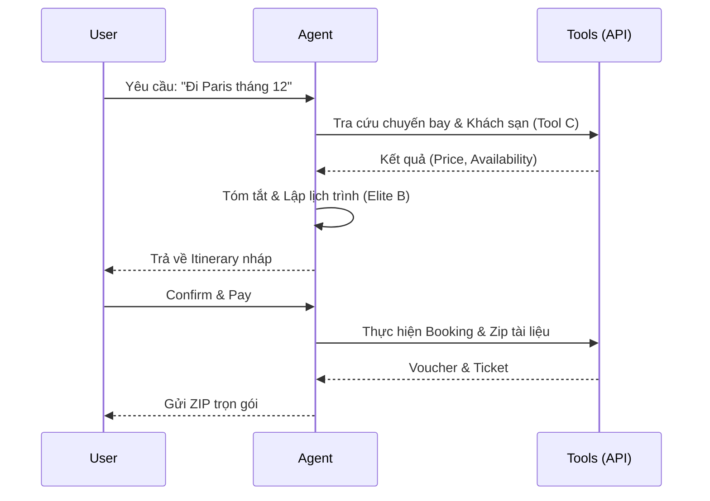

# Solution Design Document (SDD) - AI_Travel_Concierge

*Mục tiêu: Đặc tả kiến trúc kỹ thuật cho dự án AI_Travel_Concierge, đảm bảo tính khả thi và an toàn (Elite Framework Sync).*

## 1. High-Level Architecture
Hệ thống sử dụng kiến trúc Agentic Workflow với các thành phần chính:
- **Core Orchestrator**: GPT-4o điều phối các luồng xử lý.
- **Toolbox**: Các API đặt chỗ (Amadeus, Booking) và tìm kiếm thông tin.
- **Memory Buffer**: Lưu trữ ngữ cảnh chuyến đi và sở thích người dùng.

## 2. Tech Stack Setup (Elite Point C Mapping)
- **Language**: Node.js / TypeScript.
- **AI Model**: GPT-4o (Primary), GPT-4o-mini (Fallback).
- **Integrations**: 
  - `Amadeus API`: Tra cứu vé máy bay & Khách sạn.
  - `Google Maps API`: Tìm kiếm địa điểm và tính toán khoảng cách.
  - `JSZip`: Đóng gói lịch trình và voucher.

## 3. Data Schema (Core Models)
- **Itinerary Object**:
  - `journey_id`: UUID.
  - `legs`: Array of `Flight/Hotel/Tour`.
  - `total_price`: Number.
  - `status`: `Draft | Confirmed | Cancelled`.

## 4. Sequence Diagram (Main Flow)

## 5. Risk Mitigation (Elite Point F Sync)
| Rủi ro (Elite F) | Giải pháp Kỹ thuật (SDD) |
|---|---|
| **Hallucination** | Sử dụng Tool-Use (Function Calling) để lấy dữ liệu thực; Double-Check giá trước khi thanh toán. |
| **Tool Misuse** | Thiết lập Range-check cho ngày và giá; Giới hạn quyền API chỉ trong Booking/Search. |
| **API Timeout** | Xây dựng Retry logic (3 lần) và Fallback sang cache dữ liệu 1 giờ trước đó. |

## 6. Definition of Done (DoD) - Agent 2
Bản thiết kế này đáp ứng:
- [x] Ánh xạ đầy đủ các tính năng Must-have từ BRD (Elite A).
- [x] Đã xác định rõ các Tool (Elite C) và phương án xử lý lỗi (Elite F).
- [x] Sẵn sàng để chuyển giao sang Agent 3 để viết đặc tả chi tiết.
