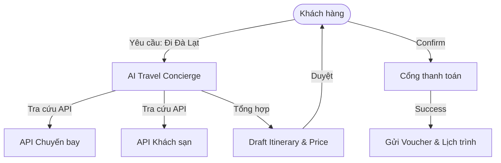

# Business Requirement Document (BRD) - AI_Travel_Concierge

*TL;DR: AI_Travel_Concierge là một Agent thông minh giúp lập kế hoạch du lịch cá nhân hóa 100%, thực hiện đặt chỗ qua API và hỗ trợ thay đổi lịch trình theo thời gian thực.*

## 1. Agent Charter (Elite Point A)
- **Identify (Agent là ai?)**: Một trợ lý du lịch AI (Travel Concierge AI) chuyên nghiệp, có khả năng truy cập dữ liệu chuyến bay, khách sạn và kiến thức địa phương.
- **Nghiệm vụ chính**: Lập kế hoạch, Đặt chỗ (Booking), và Xử lý sự cố (Re-routing).
- **Boundaries (Không làm)**: Không tư vấn tài chính, không thực hiện các giao dịch ngoài phạm vi du lịch.
- **Value & KPIs**: 
  - Giá trị: Tiết kiệm 5-10 giờ lên kế hoạch.
  - KPI: Tỷ lệ đặt chỗ thành công > 98%, Thời gian phản hồi < 10s.
- **Main Risks**: Lỗi tích hợp API (Booking failure), Ảo giác về giá (Hallucination on pricing).

## 2. Business Objective (Bài toán & Giá trị)
- **Bài toán**: Người dùng mất quá nhiều thời gian để so sánh giá và lên lịch trình trên nhiều ứng dụng rời rạc.
- **Giá trị kỳ vọng**: Một điểm chạm duy nhất từ lúc lên ý tưởng đến khi kết thúc chuyến đi.
- **KPIs**: Mức độ hài lòng người dùng (CSAT) > 4.5/5.

## 3. Agent Scope (Phạm vi & Actor)
- **Phạm vi**: Tìm kiếm, so sánh và đặt dịch vụ (Flight, Hotel, Tour).
- **Actor liên quan**: 
  - Khách du lịch (User).
  - API bên thứ 3 (Amadeus, Booking.com, Google Maps).

## 4. Autonomy & Human Oversight
- **Mức tự chủ**: Trung bình (AI tìm kiếm và đề xuất).
- **Bước cần duyệt**: User Cần bấm "Confirm Payment" cho mọi giao dịch thanh toán thực tế.
- **Điều kiện bàn giao**: Lịch trình (Itinerary) chi tiết kèm mã xác nhận đặt chỗ.

## 5. Job-to-be-Done (JTBD)
> *"Khi tôi muốn đi du lịch nhưng quá bận để tìm hiểu, tôi muốn một trợ lý hiểu rõ sở thích của mình, tự động tìm deal tốt nhất và đặt chỗ cho tôi, để tôi chỉ việc xách vali lên và đi mà không lo lắng về thủ tục."*

## 6. User Flow (Mermaid)

## 7. RAID Log
- **Risk**: Hallucination về giờ bay/giá phòng. (Giải pháp: Real-time validation trước khi thanh toán).
- **Assumption**: User đã có hộ chiếu/giấy tờ cần thiết.
- **Dependency**: Phụ thuộc vào API bên thứ 3.
- **Issue**: Tốc độ phản hồi của một số API tour địa phương chậm.

## 8. Feature List (Priority)
- **Must-have**: Tìm kiếm & Đặt Chuyến bay/Khách sạn, Lập lịch trình 3-5 ngày.
- **Should-have**: Gợi ý nhà hàng theo khẩu vị, Dự báo thời tiết.
- **Won't-have (MVP)**: Đặt Grab/Taxi, Mua bảo hiểm du lịch.
