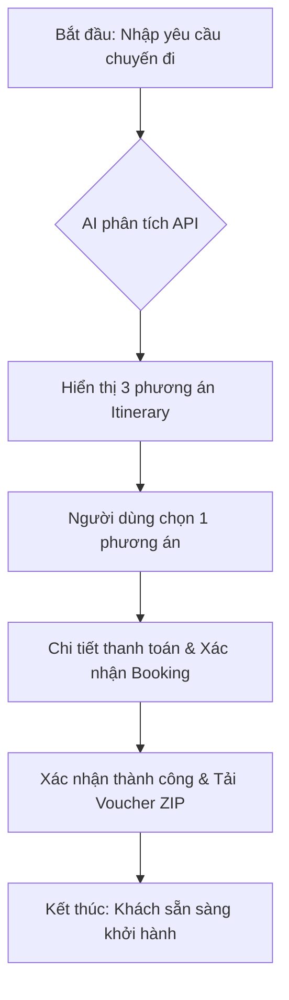

# Software Requirements Specification (SRS) - AI_Travel_Concierge

*Mục tiêu: Đặc tả chi tiết hành vi và quy tắc vận hành cho Agent AI_Travel_Concierge (Elite Framework B-F).*

## 1. Introduction
Tài liệu này chi tiết hóa cách Agent ra quyết định, sử dụng công cụ và kiểm soát rủi ro để thực hiện các nghiệp vụ du lịch.

## 2. Agent Workflow / Decision Map (Elite Point B)
Luồng ra quyết định nội bộ của Agent:
1. **Nhận Input**: Phân tích Prompt người dùng (v.d. "Tìm vé đi Đà Lạt rẻ nhất").
2. **Hiểu Intent**: Phân loại: `Search_Flight` | `Book_Hotel` | `Plan_Itinerary`.
3. **Check Context**: Kiểm tra lịch sử chuyến đi cũ và sở thích (History/Preferences).
4. **Dùng Knowledge/Tool**: Gọi `Amadeus API` để lấy dữ liệu thực tế.
5. **Sinh Output**: Đề xuất 3 phương án tối ưu nhất.
6. **Escalate/Handoff**: Nếu User hỏi về địa điểm cấm hoặc Visa phức tạp -> Bàn giao cho nhân viên hỗ trợ (Human Support).
7. **Log Outcome**: Ghi lại lịch sử tìm kiếm để tối ưu cá nhân hóa.

### 2.2. User Flow (End-to-End)
Mô tả hành trình trải nghiệm của khách hàng từ đầu đến cuối:

## 3. Tool Permission Matrix (Elite Point C)
| Tool | Mô tả | Agent Quyền | Rủi ro | Human Approval |
|---|---|---|---|---|
| `Amadeus_Search` | Tra cứu giá vé | Read-only | Thấp | No |
| `Amadeus_Book` | Thực hiện đặt chỗ | Read/Write | Cao | **Yes (User Click)** |
| `Google_Maps` | Tìm đường/Địa điểm | Read-only | Thấp | No |

## 4. Prompt Requirement Spec (Elite Point D)
- **Persona**: Một Travel Expert tận tâm, am hiểu địa phương và luôn tính toán chi phí tối ưu.
- **Task Objective**: Chuyển đổi yêu cầu ngôn ngữ tự nhiên thành Itinerary khả thi.
- **Instruction Priority**: 1. An toàn & Hợp pháp -> 2. Ngân sách người dùng -> 3. Sở thích cá nhân.
- **Forbidden Behaviors**: Tuyệt đối không gợi ý các hoạt động phi pháp; Không tự ý thanh toán khi chưa có lệnh "Confirm".

## 5. Knowledge Source Map (Elite Point E)
| Nguồn dữ liệu | Owner | Độ tin cậy | Refresh Cycle | Type |
|---|---|---|---|---|
| Flight Data | Amadeus | Tuyệt đối | Real-time | SoT |
| Hotel Reviews | Booking.com | Cao | Daily | Reference |
| Travel Policy | Internal | Tuyệt đối | Monthly | SoT |

## 6. Risk & Guardrail Matrix (Elite Point F)
- **Hallucination**: AI tự sinh giá ảo. (Guardrail: Bắt buộc gọi API Check-price trước khi hiển thị).
- **Data Leakage**: Lộ thông tin Hộ chiếu. (Guardrail: Mã hóa dữ liệu nhạy cảm, chỉ truyền token cho API).
- **Over-autonomy**: Tự ý đặt chỗ. (Guardrail: Hệ thống yêu cầu User Token để xác thực thanh toán).

## 7. Functional Requirements (Details)
- **FR-01: Sinh lịch trình (Itinerary)**.
- **FR-02: Tính toán ngân sách (Budgeting)**.
- **FR-03: Xuất Voucher ZIP**.
