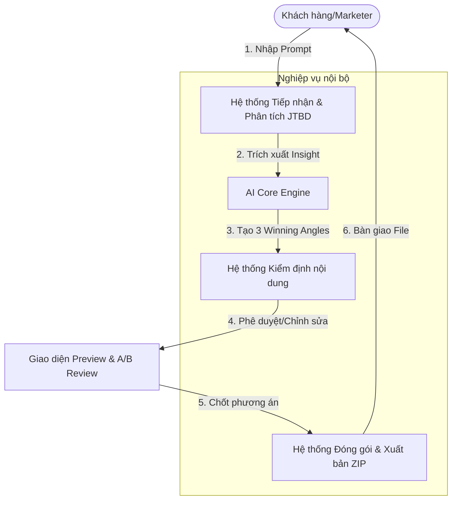

*TL;DR: PageSprint AI là giải pháp tự động sinh Landing Page từ 1 prompt duy nhất, tập trung giải quyết nút thắt về thời gian cho Media Buyers khi phải test hàng chục mẫu Ads mỗi tuần.*

# Business Requirement Document (BRD) - PageSprint AI

## 1. Agent Charter (Elite Point A)
- **Identify (Agent là ai?)**: PageSprint AI là một "Conversion Architect" tự động. Nhiệm vụ là biến các ý tưởng thô thành hạ tầng Landing Page có tỷ lệ chuyển đổi cao.
- **Boundaries (Không làm)**: Không thiết kế Logo, không quản lý Ads, không xử lý Backend phức tạp.
- **Value & KPIs**: 
  - Giá trị: Giảm 90% thời gian dựng trang.
  - KPI: Tốc độ sinh trang < 90s; CSAT > 4.0.
- **Main Risks**: Lỗi hiển thị CSS trên Mobile, Ảo giác nội dung (Copywriting hallucination).

## 2. Agent Scope (Elite Point A)
- **Nhiệm vụ chính**: Phân tích Prompt -> Sinh 3 Angles tâm lý -> Xuất bản HTML/ZIP tĩnh.
- **User/Actor liên quan**: Media Buyer, Designer (Reviewer), AI Core Engine.

## 3. Autonomy & Human Oversight (Elite Point C Mapping)
- **Mức tự chủ**: Cao trong khâu sáng tạo nội dung và cấu trúc code.
- **Bước cần duyệt**: Người dùng (Human) bắt buộc duyệt nội dung trước khi bấm "Export".
- **Điều kiện bàn giao**: Bộ file ZIP chứa HTML/CSS sạch, không lỗi hiển thị (Elite A-G).

## 3. Product Scope & Features (MoSCoW)

### Must-Have (Phạm vi cốt lõi của MVP - Bắt buộc hoàn thành)
1. **Ohm-Prompt Engine (Text-to-Sections)**: Input 1 đoạn Text (Mô tả sản phẩm + Tệp khách). AI phân chia và trả ra 1 bộ khung trang web tiêu chuẩn (Gồm các Section: Hero, Features, Testimonials, CTA) dưới dạng bản nháp hiển thị ngay (Preview).
2. **Angle Generator (Sinh biến thể A/B)**: Nút "1-Click" tự nhân bản Landing Page gốc ra 3 "Angles" (góc độ chốt sales) khác biệt (Ví dụ: [A] Đánh vào sợ hãi/nỗi đau hối tiếc, [B] Đánh vào lợi ích tài chính, [C] Đánh vào bằng chứng đám đông - Social Proof).
3. **Export to HTML/Zip tĩnh**: Bấm 1 nút xuất ra bộ mã CSS/HTML/Images tĩnh đã lên khung cứng, sẵn sàng ốp lên bất kỳ server nào chạy chuyển đổi (Tracking Conversion) ngay lập tức. (KHÔNG LÀM hệ thống chỉnh sửa kéo thả UI trong bản phát hành này).

### Should-Have (Nên có nếu dư dả thời gian làm MVP)
- Sinh thẳng thư viện ảnh nền (Stock Hero Images) cơ bản bằng API (Unsplash/Stable Diffusion) thay cho ảnh xám (Placeholder).

### Could-Have & Won't-Have (Cấm đưa vào MVP)
- Trình thiết kế kéo thả (Drag & Drop Interface) phức tạp như Ladipage / Webflow -> (Lý do lược bỏ: Tốn nhân sự dev UI đồ sộ, làm lại thứ các ông lớn đã làm quá tốt là sự lãng phí tài nguyên khởi nghiệp).
- Tích hợp cổng thanh toán (Payment Gateway), CMS quản lý bài blog -> (Lý do: Rời rạc với "Job-to-be-Done" của việc Test chiến dịch nhanh).

## 4. Business Process Flow (Quy trình nghiệp vụ)

Hệ thống PageSprint AI hỗ trợ luồng công việc tự động hóa từ ý tưởng đến trang web thực thi theo các bước sau:

1. **Giai đoạn Tiếp nhận (Input)**:
   - Marketer nhập thông tin cơ bản: Tên sản phẩm, Công dụng chính, và Đối tượng khách hàng mục tiêu.
   - Hệ thống áp dụng bộ lọc **JTBD** để xác nhận mục đích cốt lõi của Landing Page.

2. **Giai đoạn Phân tích & Sáng tạo (AI Processing)**:
   - AI phân tích tâm lý khách hàng và đề xuất 3 "Angles" (Hướng tiếp cận nội dung) khác nhau:
     - *Angle 1*: Tập trung vào Nỗi đau/Rủi ro (Fear/Loss Aversion).
     - *Angle 2*: Tập trung vào Lợi ích/Mong muốn (Gain/Ambition).
     - *Angle 3*: Tập trung vào Bằng chứng/Uy tín (Trust/Social Proof).
   - Hệ thống tự động thiết kế cấu trúc Information Architecture (IA) cho từng Angle.

3. **Giai đoạn Hiển thị & Duyệt (Preview)**:
   - Marketer xem trước (Preview) 3 phương án Landing Page ngay trên giao diện ứng dụng.
   - Cho phép chỉnh sửa nhanh nội dung văn bản (Copywriting) nếu cần thiết.

4. **Giai đoạn Xuất bản & Thực thi (Export/Deployment)**:
   - Marketer chọn phương án (hoặc cả 3) và bấm "Export".
   - Hệ thống đóng gói toàn bộ Code (HTML/CSS) và Tài nguyên ảnh vào 1 file **ZIP tĩnh**.
   - Marketer tải về và upload lên Host/Server cá nhân để bắt đầu chạy Ads.

## 5. Business Process Diagram (Sơ đồ quy trình nghiệp vụ)

Sơ đồ dưới đây mô tả chuỗi giá trị từ khi tiếp nhận yêu cầu đến khi bàn giao sản phẩm cuối cùng cho khách hàng:

## 6. RAID Log (Quản trị Rủi ro & Giả định)

| Phân loại | Nội dung | Tác động | Giải pháp giảm thiểu / Xác thực |
|-----------|----------|----------|---------------------------------|
| **Risk** | AI sinh nội dung không phù hợp với thuần phong mỹ tục hoặc thương hiệu. | Cao | Thiết lập hệ thống "Safety Filter" và cho phép User sửa trực tiếp ở bước Preview. |
| **Assumption** | Giả định User đã có sẵn bộ nhận diện thương hiệu (Logo, Màu sắc). | Trung bình | Cung cấp các bộ Theme màu mặc định chuyên nghiệp nếu User không nhập. |
| **Dependency** | Phụ thuộc vào tính ổn định của API OpenAI/Anthropic. | Cao | Xây dựng luồng xử lý lỗi (Graceful Degradation) và sử dụng hệ thống Cache nội dung. |
| **Issue** | Tần suất "Timeout" khi sinh đồng thời 3 bản thiết kế HTML phức tạp. | Cao | Chuyển sang xử lý hàng đợi (Queue) và thông báo qua Email hoặc thông báo trình duyệt. |

## 7. Success Criteria (Tiêu chí Nghiệm thu/KPIs phần mềm)
- **Tốc độ (Speed)**: Thời gian từ lúc nhập chữ Prompt đến lúc tải thành công file Zip HTML cấu trúc phải dưới 90 giây.
- **Conversion Rate (Tỷ lệ tương tác bản thử nghiệm)**: Phải có >40% lượng người dùng truy cập hoàn thành trọn vẹn cycle sinh bộ HTML (Không tính những user bị timeout rơi rụng giữa chừng do AI load chậm).
