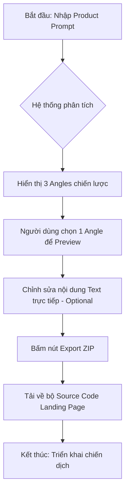

# Software Requirements Specification (SRS) - PageSprint AI

*Mục tiêu: Đặc tả chi tiết các yêu cầu chức năng và hệ thống cho MVP PageSprint AI, cung cấp hướng dẫn kỹ thuật rành mạch cho đội ngũ phát triển.*

## 1. Introduction
Tài liệu này chi tiết hóa các tính năng từ BRD và ánh xạ trực tiếp tới kiến trúc kỹ thuật trong SDD. Nó đóng vai trò là "nguồn sự thật duy nhất" (Single Source of Truth) cho việc lập trình và kiểm thử.

### 1.1. Glossary & Definitions
- **JTBD (Job-to-be-Done)**: Khung tư duy xác định nhu cầu cốt lõi của người dùng.
- **Ohm-Prompt Engine**: Bộ máy xử lý ngôn ngữ tự nhiên (NLP) dựa trên AI để chuyển đổi Prompt thô thành cấu trúc trang web.
- **Angle (Góc độ tiếp cận)**: Một biến thể nội dung tập trung vào một tâm lý khách hàng cụ thể (ví dụ: Nỗi sợ mất mát vs. Ham muốn lợi ích).
- **DSL (Domain Specific Language)**: Ngôn ngữ trung gian giữa nội dung AI và mã nguồn HTML/CSS.

## 2. Functional Requirements

### 2.1. Module 1: Ohm-Prompt Engine (AI Processing)
- **Feature Name**: Trích xuất Insight & Sinh Angle.
- **Actor**: Media Buyer / Marketer.
- **Input Data**: 
  - `Product_Description`: Text (Min 10, Max 1000 ký tự).
  - `Target_Audience`: Text (Tùy chọn).
- **Business Logic (Steps)**:
  1. Hệ thống gửi mãng Prompt chiến lược (Prompt Chaining) tới OpenAI GPT-4o.
  2. AI phân tích JTBD và trích xuất: **Pain Points**, **Core Value**, **Key Features**.
  3. AI sinh ra 3 bộ nội dung tương ứng với 3 Angles tâm lý (Fear, Gain, Social Proof).
- **Output Data**: JSON object chứa 3 Angles, mỗi Angle gồm: `Title`, `Angle_Type`, `Copywriting_Content`.

### 2.2. Module 2: Landing Page Builder (Preview & Edit)
- **Feature Name**: Hiển thị & Chỉnh sửa trực tiếp.
- **Input Data**: `Angle_Selection` (ID của 1 trong 3 mẫu).
- **System Behavior**:
  1. Chuyển đổi `Copywriting_Content` thành cấu trúc HTML sử dụng Tailwind CSS Grid.
  2. Nhúng ảnh từ thư viện Unsplash API dựa trên từ khóa trích xuất từ nội dung.
  3. Hiển thị dưới dạng iframe để đảm bảo cách ly style giữa App và Preview.
- **Editing**: Người dùng click vào text sẽ hiển thị thẻ `textarea` để ghi đè nội dung.

### 2.3. Module 3: Export ZIP (Packaging)
- **Feature Name**: Đóng gói mã nguồn tĩnh.
- **Process**:
  1. Hệ thống thu thập mã HTML cuối cùng sau khi chỉnh sửa.
  2. Gộp CSS Tailwind (phiên bản thu gọn/CDN).
  3. Sử dụng `JSZip` để tạo tệp nén.
- **Output**: Tệp `PageSprint_[AngleName]_[Timestamp].zip`.

## 3. Data Dictionary / Models

### 3.1. Angle Object
```json
{
  "id": "uuid",
  "type": "fear | gain | proof",
  "headline": "string",
  "sub_headline": "string",
  "sections": [
    { "type": "hero", "content": "..." },
    { "type": "features", "list": [] },
    { "type": "cta", "button_text": "..." }
  ]
}
```

## 4. Agent Workflow / Decision Map (Elite Point B)
Luồng ra quyết định nội bộ của Agent:
1. **Nhận Input**: Nhận Prompt từ Media Buyer (v.d. "Bán kem chống nắng cho dân văn phòng").
2. **Hiểu Intent**: Phân tích JTBD (Nhu cầu bảo vệ da vs. Tiện lợi).
3. **Check Context**: Kiểm tra các mẫu Landing Page thành công trước đó (Historical successes).
4. **Dùng Knowledge/Tool**: Gọi OpenAI API để sinh 3 Angles nội dung.
5. **Sinh Output**: Đưa ra 3 bản Preview HTML kèm giải thích tâm lý.
6. **Escalate/Handoff**: Nếu Prompt vi phạm chính sách nội dung -> Từ chối và báo lỗi cho User.
7. **Log Outcome**: Ghi lại tỷ lệ Click-to-Export của từng mẫu.

### 4.2. User Flow (End-to-End)
Mô tả hành trình trải nghiệm của người dùng từ đầu đến cuối:



## 5. Knowledge Source Map (Elite Point E)
| Nguồn tri thức | Owner | Độ tin cậy | Refresh Cycle | Type |
|---|---|---|---|---|
| JTBD Framework | Strategy Team | 100% | Static | SoT |
| Tailwind CSS | Public Docs | 100% | Real-time | Reference |
| Unsplash Library | Public API | 80% | Live | Reference |

## 6. Tool Permission Matrix (Elite Point C)
| Tool | Mô tả | Quyền Agent | Rủi ro | Approval |
|---|---|---|---|---|
| OpenAI API | Sinh nội dung & Code | Read/Write | Trung bình | No |
| JSZip | Đóng gói ZIP | Local Execute | Thấp | No |
| Unsplash API | Tìm ảnh Stock | Search-only | Thấp | No |

## 7. Risk & Guardrail Matrix (Elite Point F)
- **Hallucination**: AI sinh sai thông tin sản phẩm. (Guardrail: Reviewer bắt buộc sửa ở Preview).
- **Tool Misuse**: Sinh file ZIP quá lớn. (Guardrail: Giới hạn số lượng Assets nhúng).
- **Compliance**: Nội dung phản cảm. (Guardrail: OpenAI Content Filter + Internal Keyword Blocking).
- **Over-autonomy**: Tự ý thay đổi Domain/DNS mà không có lệnh của User.

## 8. Prompt Requirement Spec (Elite Point D)
- **Persona**: Một chuyên gia Conversion Rate Optimization (CRO) sắc sảo.
- **Task Objective**: Chuyển ý tưởng sản phẩm thành 3 Angles chốt sale mạnh mẽ.
- **Instruction Priority**: 1. Cấu trúc HTML Tailwind chuẩn -> 2. Tâm lý khách hàng -> 3. Tỉa tót nội dung.
- **Forbidden Behaviors**: Không sinh code JS độc hại; Không tự ý thay đổi màu Brand Color nếu đã được chỉ định.

## 9. Evaluation & Acceptance Criteria (Point 9)
- **Accuracy**: Code HTML phải valid 100% (không lỗi thẻ chưa đóng).
- **Completion**: Phải có ít nhất 4 section cơ bản (Hero, Feature, CTA).
- **Safety**: Không chứa script độc hại trong bundle xuất ra.
- **KPI**: Thời gian xử lý trung bình < 45s.

## 10. Logging & Monitoring (Point 10)
- **Log**: Ghi lại Prompt đầu vào, Model AI sử dụng, Thời gian xử lý.
- **Audit Trail**: Lưu lịch sử các phiên bản đã Export của User.
- **Feedback Loop**: Nút "Thích/Không thích" tại mỗi mẫu thiết kế để cải thiện Prompt Chaining.

## 11. Traceability
- [BRD - PageSprint_AI_BRD.md](../BRD/PageSprint_AI_BRD.md)
- [SDD - PageSprint_AI_Solution_Design.md](../Design/PageSprint_AI_Solution_Design.md)
