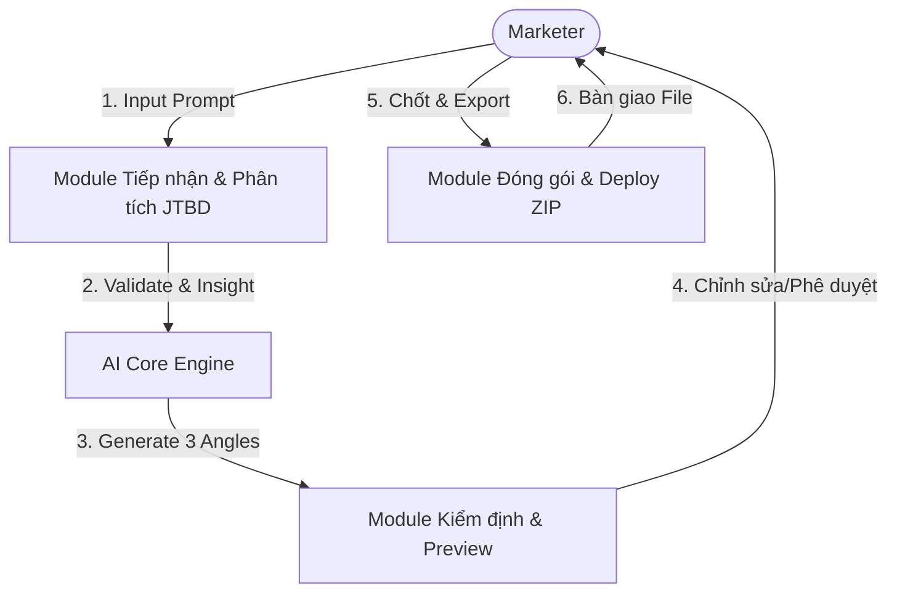

# Solution Design Document (SDD) - PageSprint AI

*TL;DR: PageSprint AI sử dụng kiến trúc Serverless với Next.js và OpenAI API để tối ưu hóa tốc độ sinh Landing Page. Hệ thống xuất ra bản Zip HTML tĩnh giúp người dùng triển khai ngay lập tức không cần cấu hình phức tạp.*

## 1. Technical Overview
PageSprint AI là một ứng dụng web (SaaS) cho phép Marketer biến mô tả thô thành Landing Page hoàn chỉnh. 
- **Core Engine**: Sử dụng Prompt Chaining để tách biệt khâu viết nội dung (Copywriting) và khâu dựng khung (Layouting).
- **Output Strategy**: Trả về file ZIP chứa HTML/CSS tĩnh (Zero-dependency).

## 2. Technology Stack (Lựa chọn tối ưu)
| Thành phần | Công nghệ Đề xuất | Lý do lựa chọn |
|------------|-----------------|----------------|
| **Frontend** | Next.js (React) + Tailwind CSS | Tốc độ phát triển nhanh, SEO tốt, UI mượt mà. |
| **Backend** | API Routes (Vercel Serverless) | Phù hợp với luồng gọi AI, không cần quản lý server. |
| **AI Model** | OpenAI GPT-4o | Thông minh nhất trong việc sinh cấu trúc HTML hợp lệ. |
| **Database** | PostgreSQL + Supabase | Quản lý User và Project với Auth cực nhanh. |
| **Deployment** | Vercel | Deploy tự động, CI/CD tích hợp sẵn. |

## 3. Data Flow & Interaction
Sơ đồ chuỗi giá trị và luồng dữ liệu trung tâm:

## 4. UI/UX Prototype Summary
- **Màn hình Dashboard**: Quản lý các dự án đã tạo.
- **Màn hình Generator**: Split-screen (Trái: Input/Sửa - Phải: Preview 3 mẫu).
- **Visuals**: Dark Mode (Saffron & Slate), hiệu ứng "Baking" khi AI đang sinh mã.

## 5. Đặc tả Kỹ thuật Hệ thống (AI Pipeline)

### 5.1. Prompt Chaining (Ohm-Prompt Engine)
- **Step 1 (Strategy)**: AI xác định JTBD và Insight từ yêu cầu người dùng.
- **Step 2 (Copywriting)**: Sinh nội dung cho từng Section theo Angle được chọn.
- **Step 3 (DSL-to-HTML)**: Chuyển đổi nội dung thành mã Tailwind CSS chuẩn.

### 5.2. Hệ thống Export
- Sử dụng thư viện `JSZip` phía server để nén mã nguồn thành file ZIP tải về.
- Các ảnh nền (Backgrounds) sẽ được nhúng qua URL API của Unsplash.

## 6. RAID & Cost Management (Elite Framework Sync)
- **Tool Mapping (Elite Point C)**: Hệ thống sử dụng `OpenAI API` cho sáng tạo và `JSZip` cho đóng gói. Mọi lệnh gọi API được kiểm soát bởi Rate-limiting.
- **Risk Mitigation (Elite Point F)**: 
  - **Hallucination**: Triển khai `Check-price` và `Validator` cho mã HTML được sinh ra.
  - **Over-autonomy**: AI không có quyền tự thay đổi Domain/DNS mà không có lệnh của User.
- **Error Fallback**: Chuyển sang GPT-4o-mini để xử lý các format HTML nếu mô hình chính bị lỗi hoặc timeout.
- **Cost**: Ước tính ~$0.05 token AI cho mỗi dự án (3 Angles).
