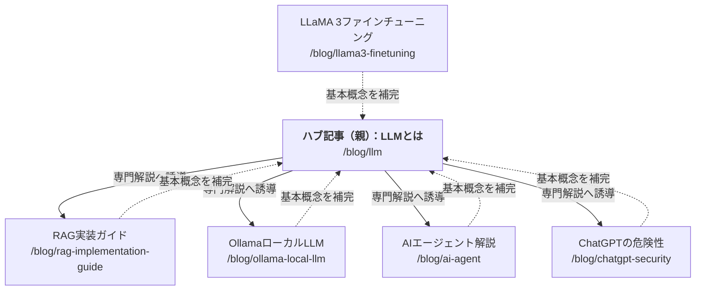

# LLMハブ記事への内部リンク設置（逆リンク）戦略

今回リライトした「LLMとは」の記事（`/blog/llm`）をトピッククラスターの親（ハブ）とし、既存の専門記事から逆リンクを設置することで、SEOの専門性と権威性を向上させます。

## 逆リンク設置の全体像

## 各記事への設置指示

### 1. RAG実装ガイド (`/blog/rag-implementation-guide`)
- **設置場所**: 導入文の「RAGとは〜」の直後、または「RAGが必要な理由」セクションの冒頭
- **アンカーテキスト**: [LLM（大規模言語モデル）の基本]
- **文案例**: 「RAGを理解するには、まず基盤となる[LLM（大規模言語モデル）の基本]を押さえておくことが重要です。」

### 2. OllamaローカルLLMガイド (`/blog/ollama-local-llm`)
- **設置場所**: 導入文、または「なぜローカルLLMなのか」セクション
- **アンカーテキスト**: [LLMとは何か？]
- **文案例**: 「そもそも[LLMとは何か？]という基礎知識については、こちらの記事で詳しく解説しています。」

### 3. AIエージェント解説 (`/blog/ai-agent`)
- **設置場所**: 「AIエージェントと生成AIの違い」セクション
- **アンカーテキスト**: [LLM（大規模言語モデル）]
- **文案例**: 「AIエージェントは、[LLM（大規模言語モデル）]を高度な推論エンジンとして活用し、自律的に動作する仕組みです。」

### 4. LLaMA 3ファインチューニング (`/blog/llama3-finetuning`)
- **設置場所**: 「LLaMA 3とは」または「ファインチューニングのメリット」冒頭
- **アンカーテキスト**: [大規模言語モデル（LLM）]
- **文案例**: 「LLaMA 3は、Meta社が開発した世界最高峰の[大規模言語モデル（LLM）]の一つです。」

### 5. ChatGPTの危険性 (`/blog/chatgpt-security`)
- **設置場所**: 「なぜ情報が漏洩するのか」セクション、またはまとめ
- **アンカーテキスト**: [LLMの仕組みとリスク対策]
- **文案例**: 「クラウド型AIの利用に不安がある方は、[LLMの仕組みとリスク対策]を正しく理解し、オンプレミス環境での運用も検討してみてください。」

---

## 期待される効果
1.  **リンクジュースの循環**: 親記事への被リンクが増えることで、「LLMとは」の検索順位向上が期待できます。
2.  **クローラビリティの向上**: 検索エンジンがトピック全体の関連性を正しく理解できるようになります。
3.  **滞留時間の延長**: 基礎と応用を行き来する回遊動線を作ることで、読者の満足度を高め、離脱を防ぎます。
