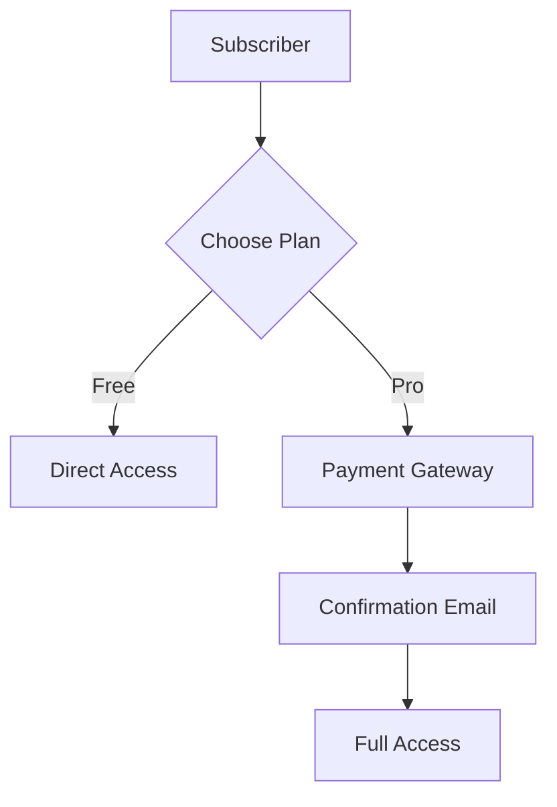

# Skill: User Flow Reverse Engineering

Kỹ thuật dịch ngược các tương tác trên website thành sơ đồ User Flow (luồng người dùng) logic.

## 1. Mục tiêu
Xác định chuỗi hành động mà một người dùng thực hiện để đạt được một "Outcome" cụ thể trên nền tảng đang nghiên cứu.

## 2. Quy trình thực hiện (Execution Steps)

### Bước 1: Xác định Entry Point & Goal
- **Entry Point**: Người dùng bắt đầu từ đâu? (vd: Landing Page, Google Search, Email).
- **Goal**: Kết thúc ở đâu? (vd: Đăng ký thành công, Xuất báo cáo, Hoàn tất thanh toán).

### Bước 2: Quan sát các Touchpoints
Ghi lại các bước trung gian dựa trên:
- Các nút bấm (Call to Action - CTA).
- Các biểu mẫu (Forms).
- Các trang chuyển hướng (Redirects/Success pages).

### Bước 3: Vẽ sơ đồ luồng (Flow Mapping)
Sử dụng logic: `Action -> System Response -> Next Action`.
- **Happy Path**: Luồng lý tưởng không có lỗi.
- **Decision Points**: Các điểm chọn lựa (vd: Chọn gói Free vs Pro).

## 3. Output Định dạng (Mermaid)
Mô tả luồng bằng ngôn ngữ Mermaid để dễ dàng tích hợp vào BRD của Agent 1.
Example:

