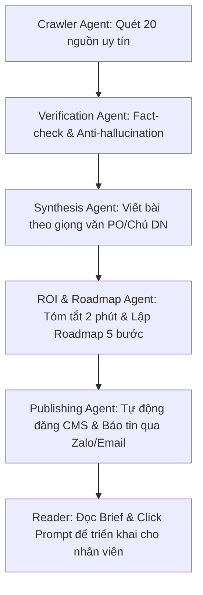

# Business Requirement Document (BRD): AI News Hub
**Project**: AI News Hub (Automated Factory)
**Version**: 1.0
**Author**: Agent 1 (Strategy)

## 1. Business Objective
Xây dựng một "Nhà máy tin tức AI" tự động hóa 100%, chuyên biệt phục vụ chủ doanh nghiệp (SME) để họ nắm bắt cơ hội ROI từ AI mà không tốn công nghiên cứu.

## 2. Business Process Flow (Automated Pipeline)

## 3. Product Features
- **Auto-Briefing**: Tóm tắt tin nóng trong 3 gạch đầu dòng (ROI focus).
- **Owner's Toolkit**: Nút bấm tự sinh ra Prompt cho nhân viên (Zalo/Slack friendly).
- **Smart Tags**: Phân loại theo ngành nghề (AI cho Retail, AI cho Manufacturing...).

## 4. Non-Functional Requirements (NFR)
- **NFR_01: Accuracy (Độ chính xác)**: Ưu tiên Fact-check chéo. Nếu tin có độ tin cậy thấp, AI phải dán nhãn "Speculative" (Suy đoán).
- **NFR_02: Performance**: Tốc độ xử lý từ khi tin nổ ra đến khi đăng tải < 30 phút.
- **NFR_03: Scalability**: Xử lý 1.000+ đầu mục tin mỗi ngày để lọc ra 10 bài chất lượng nhất.
- **NFR_04: SEO**: Tự động tối ưu hóa Keyword Trend (Google Trends API).
