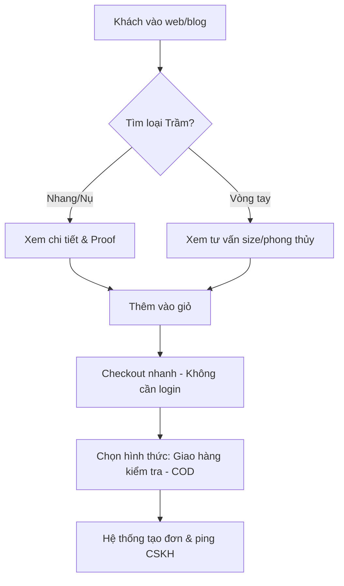
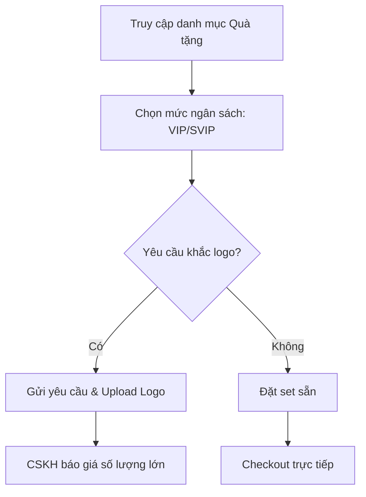

# Business Requirement Document (BRD): Hệ thống E-commerce Trầm Hương Hudo
**Project**: Trầm Hương Hudo (Clone & Strategy Upgrade)
**Version**: 1.0
**Author**: Agent 1 (Idea Intake & Strategy)

## 1. Business Objective
Xây dựng nền tảng thương mại điện tử chuyên biệt cho sản phẩm Trầm Hương, tối ưu hóa trải nghiệm mua sắm từ "Xưởng sản xuất tận gốc" đến tay người tiêu dùng cuối và đối tác doanh nghiệp.

## 2. Business Process Flow (Sơ đồ quy trình nghiệp vụ)

### 2.1 Luồng Mua hàng & Checkout (B2C)

### 2.2 Luồng Đặt Set Quà tặng (B2B/Gift)

## 3. Product Features (Tóm tắt)
- **Danh mục linh hoạt**: Nụ, Nhang, Vòng, Tinh dầu, Dụng cụ thưởng trầm.
- **Set quà tặng doanh nghiệp**: Customize theo ngân sách.
- **Blog giáo dục**: Hệ thống bài viết "Hương Đạo" để tăng Trust.

## 4. Non-Functional Requirements (NFR)
- **NFR_01: Tốc độ (Performance)**: LCP < 2.5s trên Mobile (User mua trầm thường có độ tuổi trung niên, nhạy cảm với sự chậm trễ của công nghệ).
- **NFR_02: Độ tin cậy (Trust)**: Hiển thị minh bạch Chứng nhận trầm tự nhiên và hình ảnh thực tế tại xưởng Quảng Nam.
- **NFR_03: SEO**: Cấu trúc URL thân thiện (vd: `/nhang-tram-huong-sach-cao-cap`).
- **NFR_04: Bảo mật**: Mã hóa thông tin khách hàng mua làm quà tặng kín đáo.
