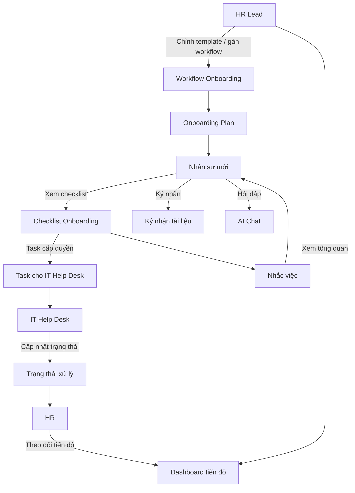

# Business Requirement Document (BRD) - NewHire Onboarding AI

## 1. Agent Charter (Elite Point A)
- **Identify**: NewHire Onboarding AI là ứng dụng onboarding nội bộ dành cho công ty khoảng 500 nhân sự, giúp điều phối checklist, ký nhận, cấp quyền IT, hỏi đáp AI và theo dõi tiến độ onboarding nhiều vai trò.
- **Boundaries**:
  - Không thay thế toàn bộ tool nội bộ hiện có của công ty.
  - Không bao gồm payroll, performance review, LMS đầy đủ, hay HRIS tổng thể.
  - Không xử lý các nghiệp vụ HR ngoài phạm vi onboarding nhân sự mới.
- **Value**:
  - Giảm tải vận hành cho HR.
  - Chuẩn hóa quy trình onboarding giữa các nhân sự mới.
  - Tăng tốc hòa nhập cho nhân sự mới.
  - Minh bạch tiến độ giữa HR, HR Lead, IT Help Desk và nhân sự mới.
- **KPIs chính**:
  - Giảm thời gian xử lý onboarding thủ công cho HR.
  - Tăng tỷ lệ hoàn thành checklist onboarding đúng hạn.
  - Giảm số lần HR phải nhắc việc hoặc trả lời lặp lại.
- **Main Risks**:
  - Phụ thuộc vào tích hợp với tool nội bộ hiện tại.
  - Nếu dữ liệu tài liệu/policy chưa chuẩn, AI có thể trả lời không nhất quán.
  - Nếu workflow giữa HR và IT chưa rõ, task cấp quyền có thể vẫn bị trễ.

## 2. Agent Scope (Elite Point A)

### 2.1 Bối cảnh sử dụng
- Ứng dụng phục vụ nội bộ công ty quy mô khoảng 500 người.
- Hệ thống onboarding hiện tại đang chạy trên tool nội bộ của công ty.
- Ứng dụng mới phải tích hợp với tool nội bộ hiện tại thay vì thay thế hoàn toàn.

### 2.2 Actors
- **HR**:
  - Theo dõi onboarding từng nhân sự mới.
  - Tạo và quản lý checklist/worfklow ở mức vận hành.
- **HR Lead**:
  - Xem báo cáo và tổng quan toàn cục.
  - Chỉnh template onboarding.
  - Gán workflow.
- **Nhân sự mới**:
  - Xem checklist.
  - Ký nhận tài liệu.
  - Theo dõi các việc cần làm.
  - Hỏi AI chat khi cần hỗ trợ.
- **IT Help Desk**:
  - Nhận task cấp quyền.
  - Cập nhật trạng thái thực hiện.

### 2.3 In Scope
- Checklist onboarding cho nhân sự mới.
- Ký nhận tài liệu/policy.
- Workflow task cấp quyền cho IT Help Desk.
- AI chat hỗ trợ onboarding.
- Reminder/nhắc việc.
- Theo dõi tiến độ onboarding theo vai trò.
- Tích hợp với tool nội bộ hiện tại.

### 2.4 Out of Scope
- Payroll, compensation, benefits administration.
- Đánh giá hiệu suất.
- Đào tạo nâng cao ngoài onboarding.
- Thay thế toàn bộ hệ thống quản trị nhân sự đang tồn tại.

## 3. Autonomy & Human Oversight (Elite Point C)
- **Mức tự động hóa**:
  - Hệ thống tự động điều phối checklist, reminder và phân phối task theo workflow đã cấu hình.
  - AI chat hỗ trợ trả lời câu hỏi onboarding dựa trên knowledge nội bộ.
- **Bước cần con người xác nhận**:
  - HR/HR Lead xác nhận template và workflow.
  - IT Help Desk cập nhật trạng thái task cấp quyền.
  - Nhân sự mới tự hoàn thành hoặc ký nhận các bước bắt buộc.
- **Giới hạn AI**:
  - AI không được tự thay đổi workflow.
  - AI không được tự xác nhận hoàn thành task.
  - AI không được thay HR/IT xử lý ngoại lệ nghiệp vụ.

## 4. Business Process Flow (Elite Point B)
1. HR Lead cấu hình hoặc điều chỉnh template onboarding và gán workflow phù hợp.
2. Khi có nhân sự mới, hệ thống tạo onboarding plan dựa trên workflow đã gán.
3. Nhân sự mới đăng nhập, xem checklist, ký nhận tài liệu và thực hiện các bước bắt buộc.
4. Các task liên quan đến cấp quyền được gửi sang IT Help Desk.
5. IT Help Desk cập nhật trạng thái xử lý task cấp quyền trong hệ thống.
6. Hệ thống gửi nhắc việc cho các bước chưa hoàn thành.
7. HR theo dõi tiến độ vận hành từng nhân sự mới.
8. HR Lead xem báo cáo, tổng quan và điều chỉnh template/workflow khi cần.
9. AI chat hỗ trợ người dùng tra cứu câu hỏi onboarding trong quá trình thực hiện.

## 5. User Flow Diagram (Mermaid)

## 6. RAID Log (Elite Point F)

| Loại | Nội dung | Tác động | Hướng xử lý |
|------|----------|----------|-------------|
| Risk | Tích hợp với tool nội bộ hiện tại phức tạp hơn dự kiến | Cao | Chốt rõ điểm tích hợp tối thiểu trong MVP |
| Risk | Workflow thực tế giữa HR và IT chưa thống nhất hoàn toàn | Cao | Chuẩn hóa trách nhiệm và trạng thái task trước khi build |
| Risk | AI chat trả lời không nhất quán nếu knowledge base rời rạc | Trung bình | Chỉ cho phép AI truy xuất nguồn onboarding đã duyệt |
| Assumption | Tool nội bộ hiện tại có khả năng tích hợp dữ liệu/user/workflow tối thiểu | Cao | Cần xác thực kỹ với team kỹ thuật nội bộ |
| Dependency | Cần tài liệu onboarding, policy, và rule cấp quyền đã sẵn sàng | Cao | Chuẩn hóa nội dung đầu vào trước khi rollout |
| Issue | HR đang mất thời gian xử lý thủ công và theo dõi tiến độ bằng cách không tập trung | Cao | Dùng dashboard và reminder để giảm điều phối tay |

## 7. Feature List (Priority - MoSCoW)

### Must-Have
1. Checklist onboarding theo nhân sự mới.
2. Ký nhận tài liệu/policy trong app.
3. Task cấp quyền được chuyển cho IT Help Desk.
4. IT Help Desk cập nhật trạng thái task.
5. Reminder cho các bước chưa hoàn thành.
6. AI chat hỗ trợ câu hỏi onboarding.
7. Dashboard theo dõi tiến độ cho HR.
8. Tổng quan, chỉnh template và gán workflow cho HR Lead.
9. Tích hợp với tool nội bộ hiện tại.

### Should-Have
- Báo cáo theo nhóm/phòng ban/cohort onboarding.
- Lịch sử hoạt động theo từng nhân sự mới.

### Could-Have
- Gợi ý câu hỏi phổ biến theo từng giai đoạn onboarding.
- Escalation rule cho task IT quá hạn.

### Won't-Have (MVP)
- Full employee lifecycle management.
- Payroll, leave, performance, training system hoàn chỉnh.

## 8. Success Criteria
- Thời gian xử lý onboarding thủ công của HR giảm rõ rệt so với quy trình hiện tại.
- HR có thể theo dõi tiến độ onboarding tập trung thay vì kiểm tra qua nhiều nơi.
- Nhân sự mới biết chính xác cần làm gì và đã hoàn thành đến đâu.
- IT Help Desk có luồng nhận và cập nhật task cấp quyền rõ ràng.
