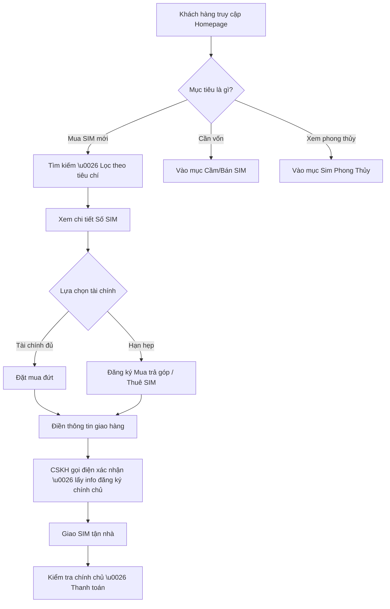

# Business Requirement Document (BRD)
**Project**: Nền tảng E-commerce Sim Thăng Long (Reverse-engineered)
**Version**: 1.0
**Author**: Agent 1 (Powered by `LearnAgent`)

## 1. Product Charter (Elite Point A)
- **Identity**: Nền tảng phân phối và giao dịch SIM số đẹp trực tuyến lớn nhất Việt Nam.
- **Boundaries**: Tập trung vào thuê bao di động (Viettel, Vinaphone, Mobifone, Itelecom...), không bán điện thoại hay phụ kiện phần cứng khác.
- **Value**: Rút ngắn thời gian tìm kiếm SIM phù hợp (theo phong thủy, năm sinh, ngũ quý) trong kho +45 triệu số; giải quyết bài toán tài chính qua Mua trả góp & Thuê SIM.
- **KPIs**: Tỷ lệ tìm kiếm thành công, CVR (Tỷ lệ chuyển đổi đơn hàng), GMV (Tổng giá trị giao dịch).
- **Risks**: Tranh chấp quyền sở hữu SIM, quy trình đăng ký chính chủ phụ thuộc nhà mạng.

## 2. System Scope (Elite Point A)
**Các Actor liên quan:**
1. **Khách hàng cá nhân/doanh nghiệp**: Tìm kiếm, mua đứt, mua trả góp, hoặc thuê SIM.
2. **Chuyên gia phong thủy**: Tư vấn trực tiếp cho khách hàng.
3. **Admin / CSKH**: Khớp lệnh đơn hàng, hỗ trợ thủ tục đăng ký chính chủ.
4. **Nhà bán/Người ký gửi**: Bán lại SIM hoặc cầm cố SIM cho hệ thống.

## 3. Autonomy & Human Oversight (Elite Point C)
- **Mức độ tự chủ của hệ thống**: Tự động gợi ý SIM theo bộ lọc, tự động định giá SIM bằng AI (Định giá SIM AI).
- **Sự can thiệp của con người (Human Oversight)**: 
  - Quy trình đăng ký thông tin chính chủ cần sự xác nhận của nhân viên CSKH (gọi điện thoại xác nhận).
  - Duyệt hồ sơ trả góp hoặc định giá SIM cầm cố giá trị cao.

## 4. Business Process Flow (Elite Point B)
*(Phần này là BẮT BUỘC CÓ do liên quan đến đặc tả nghiệp vụ luồng đi)*

**Quy trình nghiệp vụ cốt lõi (Core Business Flow): Mua SIM mới**
1. **Tiếp cận**: Khách hàng truy cập nền tảng, sử dụng bộ lọc đa chiều (Nhà mạng, Mức giá, Đầu số, Loại SIM).
2. **Khớp nhu cầu**: Khách hàng chọn được số ưng ý, xem chi tiết giá và chính sách khuyến mãi.
3. **Đặt hàng**: Điền thông tin cá nhân (Tên, SĐT, Địa chỉ). Chọn hình thức thanh toán (Trả thẳng / Trả góp).
4. **Xác nhận (Telesale)**: Nhân viên CSKH gọi điện xác nhận đơn hàng và thu thập thông tin CMND/CCCD để đăng ký chính chủ.
5. **Giao nhận**: Giao SIM miễn phí toàn quốc (30 phút - 2 ngày).
6. **Hoàn tất (Activation)**: Khách hàng lắp SIM kiểm tra, hệ thống/nhân viên xác nhận chính chủ, khách hàng thanh toán (COD hoặc chuyển khoản trước).

**Các luồng nghiệp vụ vệ tinh:**
- **Thuê SIM**: Ký hợp đồng thuê số theo tháng -> Đặt cọc -> Bàn giao quyền sử dụng tạm thời.
- **Cầm/Bán SIM**: Nhập số cần bán -> AI định giá sơ bộ -> Đàm phán giá với chuyên viên -> Ký hợp đồng chuyển nhượng.

## 5. User Flow Diagram (Mermaid)

## 6. Non-Functional Requirements (NFR)
- **Hiệu suất (Performance)**: Phải hỗ trợ truy vấn tức thời (Elasticsearch) trên kho dữ liệu khổng lồ +45 triệu số mà không bị lag.
- **Bảo mật (Security)**: Tuân thủ quy định bảo mật thông tin cá nhân (GDPR/Luật An ninh mạng VN) khi thu thập CMND/CCCD cho việc đăng ký chính chủ.
- **Nền tảng (Platform)**: Web-based (Mobile-first design) vì đa số người mua tra cứu trên điện thoại.
- **Tích hợp mạng viễn thông**: API hoặc quy trình nội bộ liên kết tới Viettel, Vinaphone, Mobifone, v.v. để kiểm tra trạng thái số (Còn/Đã bán) dạng Real-time.

## 7. RAID Log (Elite Point F)
- **Risks**: Khách hàng bùng đơn (Bom hàng) sau khi hệ thống đã lỡ kích hoạt chính chủ. Khách hàng cầm cố SIM nhưng xảy ra tranh chấp.
- **Assumptions**: Giả định kho số +45 triệu luôn được đồng bộ real-time với các đại lý cấp dưới.
- **Issues**: Việc đăng ký chính chủ cho người dưới 18 tuổi cần thủ tục phức tạp (cần người giám hộ).
- **Dependencies**: Phụ thuộc hoàn toàn vào chính sách cấp phát số và cổng đăng ký thông tin của các nhà mạng viễn thông.

## 8. Feature List (Priority - MoSCoW)

**Must-have (Bắt buộc phải có):**
- Bộ công cụ tìm kiếm và lọc SIM siêu tốc (Theo đầu số, đuôi số, nhà mạng, lặp số).
- Trang chi tiết hiển thị tình trạng SIM (Sẵn sàng xếp kho).
- Giỏ hàng & Form Checkout (Thu thập Tên, SĐT, Địa chỉ).
- Công cụ kiểm tra thông tin chủ thuê bao.

**Should-have (Nên có):**
- Tính năng tính toán trả góp hàng tháng (Installment Calculator).
- Module Định giá SIM tự động (AI Pricing based on market demand).
- Giao diện tra cứu phong thủy, ngũ hành, kinh dịch cho SĐT.

**Could-have (Có thể có thêm):**
- Hệ thống Cầm/Bán SIM (Marketplace C2B2C).
- Cổng thanh toán trực tuyến (Momo, VNPay) - Mặc dù hiện nay phần lớn vẫn thích nhận SIM rồi mới thanh toán (COD).

**Won't-have (Không có trong phase này):**
- Bán điện thoại, thẻ cào nhỏ lẻ, hoặc gói cước data không đính kèm SIM.
