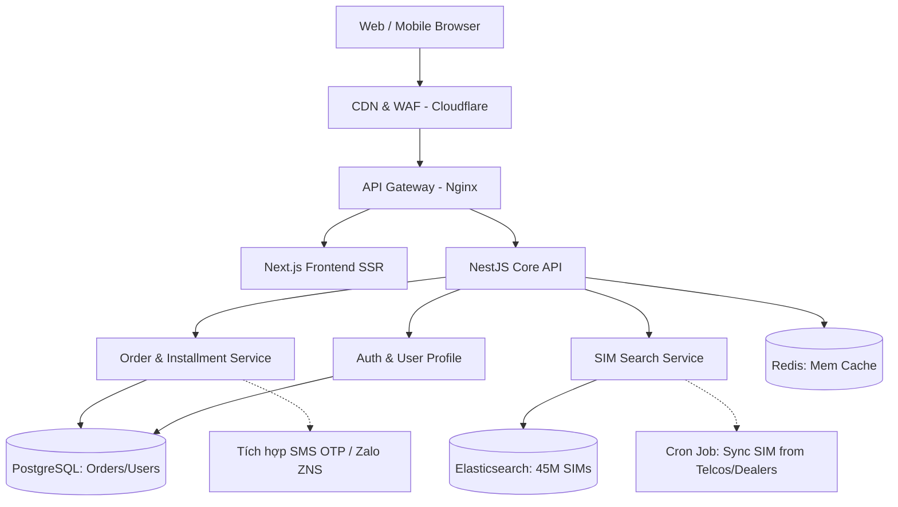

# Solution Design Document (SDD)
**Project**: Nền tảng E-commerce Sim Thăng Long (Clone)
**Version**: 1.0
**Author**: Agent 2 (AI Solution Architect)

## 1. System Architecture (Kiến trúc hệ thống)

Dựa trên yêu cầu phải xử lý kho số khổng lồ (+45 triệu SIM) và bộ lọc phức tạp, hệ thống sử dụng kiến trúc **Microservices / Modular Monolith** với công cụ tìm kiếm phân tán.

- **Frontend**: Next.js (React) - Đảm bảo Server-Side Rendering (SSR) cho SEO (rất quan trọng đối với web bán SIM) và tốc độ tải trang nhanh.
- **Backend / API**: NestJS (Node.js) - Xử lý logic nghiệp vụ, quản lý đơn hàng.
- **Database (Primary)**: PostgreSQL - Lưu trữ thông tin người dùng, đơn hàng, hóa đơn, và metadata cấu hình.
- **Search Engine**: **Elasticsearch** - Core service để lưu trữ 45 triệu bản ghi SIM. Cho phép tìm kiếm siêu tốc (theo đầu số, loại SIM, đuôi số phong thủy) mà không làm sập Database chính.
- **Caching**: Redis - Cache các bảng giá, danh mục SIM nổi bật, và session người dùng.
- **Cloud Infrastructure**: AWS hoặc Google Cloud. Sử dụng CDN (Cloudflare) để tối ưu tải ảnh và chống DDoS.

## 2. Component Diagram (Mermaid)

## 3. Database Schema (Lược đồ dữ liệu cốt lõi)

Hai bảng quan trọng nhất để hệ thống hoạt động:

**Bảng: `SimRecords` (Quản lý trong Elasticsearch & backup tại PostgreSQL)**
- `ID` (UUID)
- `PhoneNumber` (String) - Số điện thoại gốc
- `FormattedNumber` (String) - Số đã định dạng (vd: 098.365.6699)
- `Telco` (Enum: Viettel, Vinaphone, Mobifone...)
- `Category` (Enum: Tứ Quý, Năm Sinh, Tam Hoa...)
- `Price` (Decimal) - Giá bán
- `DiscountPrice` (Decimal) - Giá khuyến mãi (nếu có)
- `Status` (Enum: Available, Reserved, Sold)
- `ProviderID` (Foreign Key) - Đại lý cung cấp số này
- `FengShuiScore` (Int) - Điểm phong thủy sơ bộ

**Bảng: `Orders` (PostgreSQL)**
- `OrderID` (UUID)
- `SimID` (Foreign Key)
- `CustomerID` (Foreign Key - nullable cho Guest)
- `CustomerName`, `PhoneContact`, `ShippingAddress`
- `OrderType` (Enum: Buy_Straight, Installment, Rent)
- `TotalAmount` (Decimal)
- `PaymentStatus` (Enum: Pending, Paid)
- `FulfillmentStatus` (Enum: New, Confirmed, Delivered, Activated)
- `CreatedAt`, `UpdatedAt`

## 4. API Specification
**Quy chuẩn RESTful API kết hợp GraphQL (cho trang tìm kiếm mạnh mẽ)**
- `GET /api/v1/sims/search`
  - *Query Params*: `?telco=viettel&maxPrice=5000000&pattern=*8888`
  - *Response*: JSON danh sách SIM (pagination = 50 items/page).
- `POST /api/v1/orders/create`
  - *Body*: Thông tin giỏ hàng, thông tin giao hàng.
  - *Response*: 201 Created (OrderID, Payment URL).
- `POST /api/v1/sims/valuation` (Tính năng Định giá SIM AI)
  - *Body*: `{"phone": "0987654321"}`
  - *Response*: Khoảng giá dự đoán dựa trên ML model.

## 5. Security & Risk Mitigation
- **Data Privacy**: CMND/CCCD lấy để đăng ký chính chủ được mã hóa (AES-256) tại tầng Database, tự động xóa sau 30 ngày kích hoạt thành công.
- **Concurrency**: Tránh tình trạng 2 người cùng đặt 1 số SIM (Race condition). -> Khi đưa vào Giỏ hàng + Tiến hành checkout, "Lock" (Giữ số) trong Redis 10 phút. Hết thời gian mà không thanh toán thủ tục sẽ nhả số lại.
