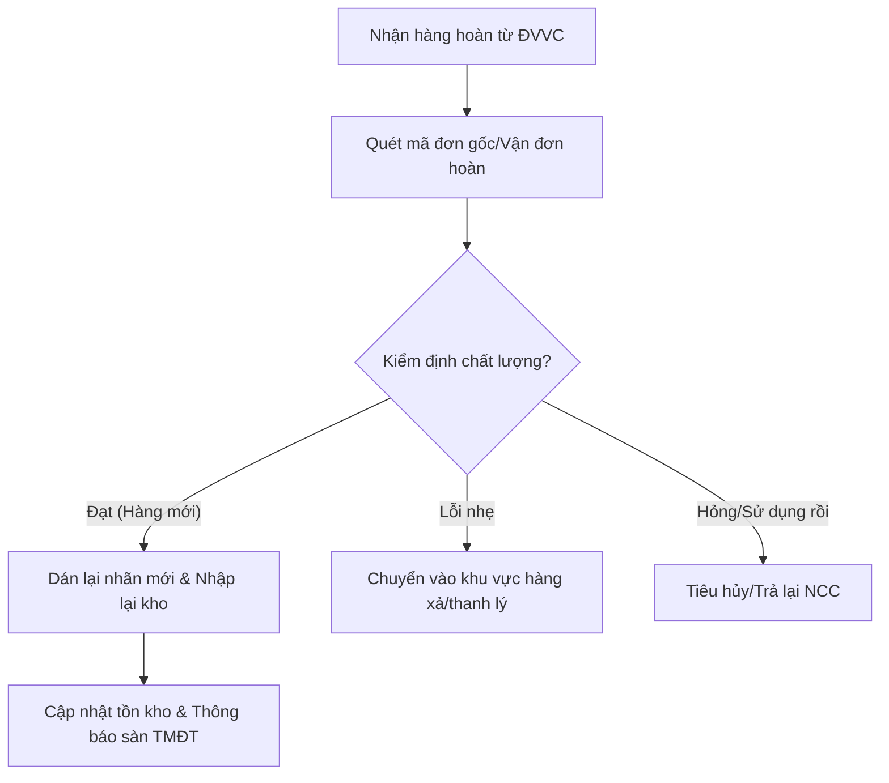
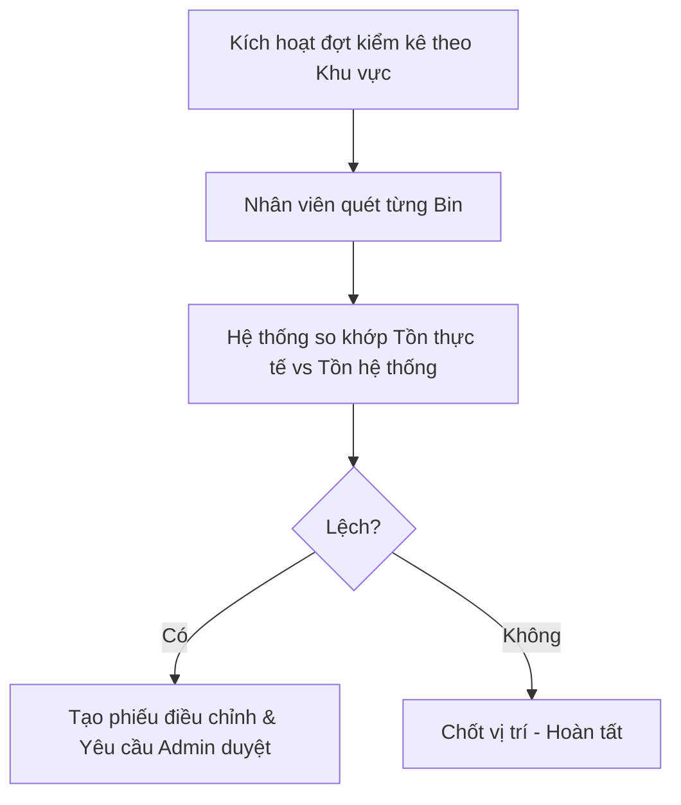

# Business Requirement Document (BRD) v2: WMS Industrial Ready
**Project**: Warehouse Management System (Elite v2)
**Version**: 2.0
**Author**: Agent 1 (Strategy)

## 1. Business Objective
Nâng cấp hệ thống WMS từ quản lý tồn kho đơn thuần lên hệ thống vận hành đa kênh (Omnichannel) chuyên nghiệp, hỗ trợ quản lý hàng hoàn và kiểm soát chất lượng (QC) nghiêm ngặt.

## 2. Business Process Flow (Bổ sung v2)

### 2.1 Luồng Xử lý Hàng hoàn (Reverse Logistics)

### 2.2 Luồng Kiểm kê (Inventory Audit)

## 3. Product Features (Advanced)
- **Batch & Expiry Tracking**: Theo dõi hàng theo Lô và Hạn sử dụng (FEFO).
- **Automated Label Printing**: Tự động sinh lệnh in QR code khi nhập kho.
- **QC Dashboard**: Theo dõi tỷ lệ hàng lỗi/hàng hoàn theo từng nhà cung cấp.

## 4. Non-Functional Requirements (v2)
- **NFR_05: Concurrency Control**: Đảm bảo không bị "overselling" khi có hàng nghìn người đặt cùng 1 SKU trong 1 giây (Megasale).
- **NFR_06: Audit Trail**: Lưu vết lịch sử thay đổi tồn kho vĩnh viễn, không cho phép xóa log.
